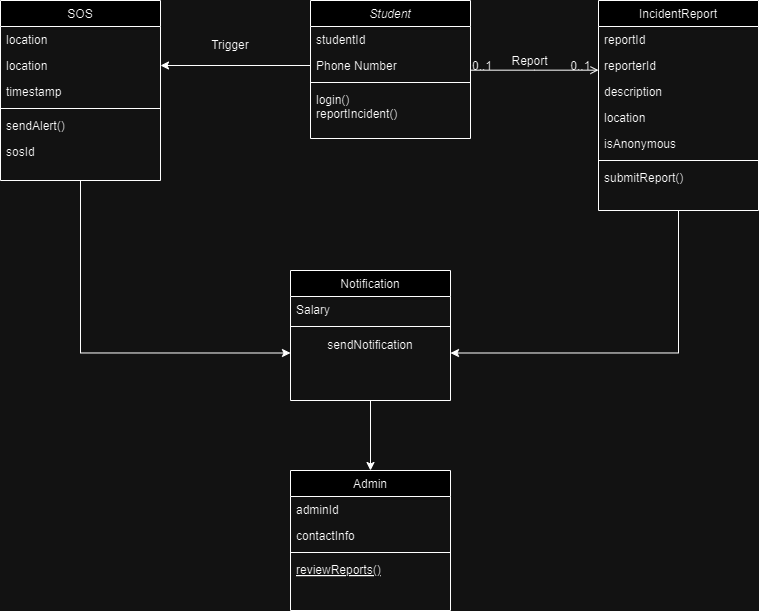
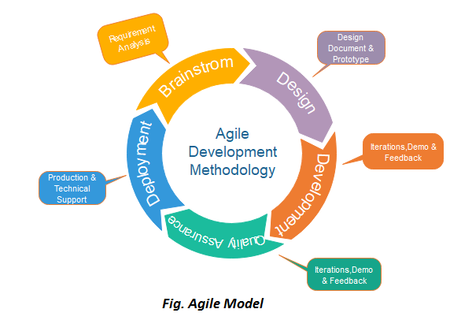

  

<h2 align="center">
  Course Title: Software Engineering
</h2>

<h2 align="center">
  Course Code: CSE-305
</h2>

  

   

<h1 align="center">SafeCampus: Anti-Ragging Reporting and Support System</h1>

 

**SafeCampus: Anti-Ragging Reporting and Support System** is a dedicated platform for **newly admitted** university students to report ragging incidents in real-time and gain support from campus authorities. This tool offers a user-friendly interface for secure reporting and resources for students to combat and prevent ragging, ultimately creating a safer campus environment.

---

 

## Need of the Project

Ragging incidents continue to be a major concern on campuses, impacting the mental and emotional well-being of students. **SafeCampus** addresses the need for a streamlined, accessible, and secure way to report such incidents and get help. By providing students with a discreet, supportive resource for reporting and receiving assistance, SafeCampus aims to enhance campus safety and create an environment where students feel secure and empowered.

 

## Requirement Gathering

To ensure a comprehensive understanding of the project requirements, the following methods were used:

- **Interviews**: Conducted with students, faculty, and campus security to identify their needs and expectations.
- **Surveys and Questionnaires**: Distributed among students, especially new entrants, to gather anonymous feedback on their concerns.
- **Observational Studies**: Analyzed campus reporting mechanisms to identify areas for improvement in the reporting process.
- **Review of Similar Systems**: Studied anti-bullying and anti-harassment reporting systems to derive functional insights.

### Functional Requirements

1. **Real-time Reporting**: Students should be able to report incidents immediately.
2. **Support Resources**: Access to mental health support and anti-ragging resources.
3. **Anonymous Reporting**: Ensures confidentiality to encourage reporting.
4. **Emergency Assistance (SOS)**: Quick access to campus security for immediate assistance.
5. **Database for Reporting Trends**: Stores data to help identify and address trends in ragging incidents.

### Non-Functional Requirements

1. **Usability**: The app should be simple and user-friendly.
2. **Security**: User data should be encrypted and securely stored.
3. **Performance**: App should operate smoothly under high loads.
4. **Scalability**: Able to handle increasing numbers of reports as the campus population grows.

 

## Features

1. **Real-time Reporting**
2. **Support & Resources**
3. **Anonymous Reporting Option**
4. **Emergency Assistance (SOS)**
5. **Database for Reporting Trends**

---

## Class Diagram

The following class diagram illustrates the architecture of the **SafeCampus** application, showcasing the key classes involved in the system, their attributes, and the relationships between them. This diagram helps visualize the structure and design of the application.

 

  

---

## Sample Test Case

| Test Case ID | Description                       | Pre-Condition               | Steps                                                                                       | Expected Result                   |
|--------------|-----------------------------------|------------------------------|---------------------------------------------------------------------------------------------|-----------------------------------|
| TC-01        | Submit a ragging report           | User is logged into the app  | 1. Open the reporting form. 2. Fill in incident details. 3. Click on “Submit” button. | Report is successfully submitted. |

 

## Possible Risks

1. **Data Privacy Risks**: Ensuring that sensitive student data is securely stored and accessed only by authorized personnel.
2. **Usability Challenges**: The app must be intuitive to encourage use, particularly under stressful conditions.
3. **Reliability**: Any failure in the SOS feature could result in delays in receiving help.

 

## Project Scheduling (Approximate)

| Phase                      | Duration |
|----------------------------|----------|
| **Requirement Gathering**  | 2 Weeks  |
| **Design**                 | 3 Weeks  |
| **Implementation**         | 5 Weeks  |
| **Testing**                | 2 Weeks  |
| **Deployment and Review**  | 1 Week   |

---

## Applying the Agile SDLC Model

The **SafeCampus** project was developed using an Agile SDLC model, breaking down the development process into three sprints. Each sprint aimed to incrementally improve functionalities based on client feedback and testing outcomes.

 

  

 

### Sprint 1

#### Requirements Gathering

- Focused on creating a safe, anonymous reporting system with easy access to resources.
- Key input was gathered from junior and senior students, as well as previously affected individuals, to ensure a well-rounded understanding of needs.

#### Design and Implementation

- **Tech Stack**: Java for backend processing, XML for frontend.
- **Initial Features**:
  - Reporting incidents
  - Access to support resources

#### Testing and Quality Assurance

- Streamlined reporting flow based on user feedback.
- UI testing for simplicity and ease of use.

#### Review

- Positive feedback with recommendations for improved privacy and anonymity in reporting.

 

### Sprint 2

#### Requirements Gathering

- Feedback highlighted the need for an anonymous reporting option and direct emergency contact features, including a one-tap **SOS System**.

#### Design and Implementation

- **Improvements**: Enhanced user interface, incorporating JavaFX animations.
- **New Features**:
  - Anonymous reporting option
  - **SOS System**: Designed as a one-tap feature to quickly alert campus security and pre-designated contacts in emergency situations.

#### Testing and Quality Assurance

- Tested the anonymity feature for confidentiality.
- Conducted stress tests on backend performance for reliability.
- Tested SOS functionality to ensure quick response times and seamless connectivity with designated contacts.

#### Review

- Positive user review, with requests to add analytics and trend identification for incident locations.

 

### Sprint 3

#### Requirements Gathering

- Finalized requirements for database integration to monitor incident trends.

#### Design and Implementation

- **Database Integration**: MySQL used for backend database storage.
- **Final Features**:
  - Data storage for trend tracking
  - Notification system for campus authorities
  - Enhanced **SOS System** functionality, including customizable contact options and integration with campus security protocols.

#### Testing and Quality Assurance

- Final QA tests confirmed smooth data handling and reporting accuracy.

#### Review

- Final product met students' expectations, with enhanced user experience and effective anti-ragging features.

---

## Submitted By

- **Name**: Md. Sohanur Rahman Hridoy
- **ID**: 2102002
- **Level**: 3, Semester I
- **Department**: CSE

## Submitted To

- **Name**: Pankaj Bhowmik
- **Position**: Lecturer
- **Department**: CSE, HSTU
